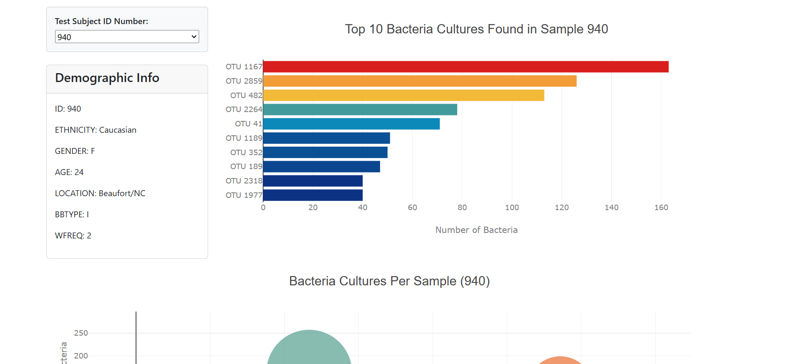

# Belly Button Biodiversity Dashboard 🌿  
Explore the fascinating world of human microbiomes with an interactive dashboard built to visualize the [Belly Button Biodiversity](https://robdunnlab.com/projects/belly-button-biodiversity/) dataset. This project showcases the microbial species living in human navels, with an emphasis on their distribution and diversity.

## 🌐 GitHub Page  
[**Belly Button Biodiversity Dashboard**](https://danomearawd.github.io/belly-button-challenge/) <br />
You can view the deployed app above:



## 🚀 Features

- **Bar Chart**: Displays the top 10 most abundant OTUs (Operational Taxonomic Units) found in an individual’s sample.
- **Bubble Chart**: Visualizes the distribution of samples across different OTUs, with interactive size and color scales.
- **Metadata Panel**: Shows the demographic information for each selected sample.
- **Interactive Dropdown**: Allows users to select a new sample and updates all charts and metadata accordingly.

## 📂 Project Structure

```plaintext
belly-button-challenge/
├── index.html            # HTML structure for the dashboard
├── samples.json          # Data containing sample and metadata
├── static/
│   └── js/
│       └── app.js        # JavaScript code for dashboard logic
```

## 📝 Summary of Operations

### Bar Chart:
- Displays the top 10 OTUs in a horizontal bar chart, sorted by abundance.
- Uses `sample_values` for the chart values, `otu_ids` for the labels, and `otu_labels` for hover text.

### Bubble Chart:
- Displays the distribution of OTUs across all samples.
- Uses `otu_ids` for the x-axis, `sample_values` for the y-axis, and adjusts marker size and color based on the sample values and OTU IDs.

### Metadata Panel:
- Fetches and displays demographic details (age, gender, ethnicity, etc.) for the selected sample.
- Loops through the metadata object to display each key-value pair in the panel.

### Dropdown Menu:
- Users can select a new sample, which triggers updates to the bar chart, bubble chart, and metadata panel.

## 🛠️ Technologies Used
- **HTML/CSS**: Markup and styling to structure and design the webpage and map layout.
- **JavaScript**: Implemented the interactive functionality and data handling.
- **D3.js**: For data manipulation and creating the interactive bar and bubble charts.
- **Plotly.js**: Used for generating the bubble chart with dynamic visualization features.

## 🙋‍♂️ Author

**Dan O'Meara**  
GitHub: [danomearawd](https://github.com/danomearawd)

## 💻 Installation

To get started with this project locally:

1. Clone the repository:
   ```bash
   git clone https://github.com/danomearawd/belly-button-challenge.git
   ```
2. Navigate to the project directory:
   ```bash
   cd belly-button-challenge
   ```
3. Open index.html in your browser to interact with the dashboard and explore the microbial data.

### Prerequisites:
- Ensure you have a modern browser with JavaScript enabled.
